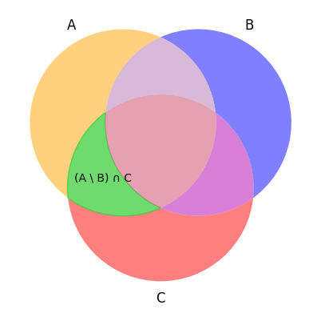
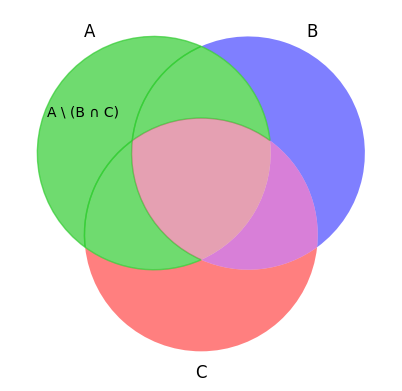
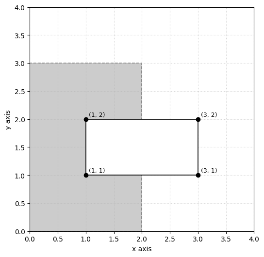

#+title: Problem Set 1
#+author: Erik An
#+email: obluda2173@gmail.com
#+date: <2025-10-03>
#+lastmod: <2025-11-12 15:15>
#+options: num:t
#+startup: overview

* Problem 1 [DONE]
** Task
Write each of the following sets by listing their elements between braces
1. {x ∈ ℤ : |2x| < 5}
2. {x ∈ ℝ : x^3 + 5x^2 = -6x}
3. {x ∈ ℝ : sin(Pi*x) = 0}
4. {5x : x ∈ ℤ, |2x| <= 8}

** Solution
. {x ∈ Z : |2x| < 5} = {0, 1, 2}
. {x ∈ R : x^3 + 5x^2 = -6x} = {-3, -2, 0}
. {x ∈ R : sin(Pi * x) = 0} = {..., -1, 0, 1, ...} or Z
. {5x : x ∈ Z, |2x| <= 8} = {0, 10, 20, 30, 40}

* Problem 2 [DONE]
** Task
Write each of the following sets in set-builder notation
1. {2, 4, 8, 16, 32, 64, ...}
2. {-5, -4, -3, -2, -1, , 0, 1}
3. {..., 1/27, 1/9, 1/3, 1, 3, 9, 27}
4. {3, 6, 11, 18, 27, 38, ...}

** Solution
. {2, 4, 8, 16, 32, 64, ...} = {2^x : x ∈ Z, x >= 1}
. {-5, -4, -3, -2, -1, , 0, 1} = {x : x ∈ Z, -5 <= x <= 1}
. {..., 1/27, 1/9, 1/3, 1, 3, 9, 27} = {x : x ∈ Z, x <= 3}
. {3, 6, 11, 18, 27, 38, ...} = {2 + x^2 : x ∈ Z, x >= 0}

* Problem 3 [DONE]
** Task
Write out the indicated sets by listing their elements between braces.
1. {x ∈ R : x^2 = 2} * {a, b, c}
2. {0, 1}^4
3. {П, 1, 0} * {-П, -1, -0}
4. {{R}}

** Solution
. {x ∈ R : x^2 = 2} * {a, b, c} = {-(2^(1/2)), 2^(1/2)} * {a, b, c}
  = {{-(2^(1/2), a}, {-(2^(1/2), b}, {-(2^(1/2), c},
  {2^(1/2), a},    {2^(1/2), b},   {2^(1/2), c}}
. {0, 1}^4 =
  {0, 1} * {0, 1} * {0, 1} * {0, 1}
  {{0, 0}, {0, 1}, {1, 0}, {1, 1}} * {{0, 0}, {0, 1}, {1, 0}, {1, 1}}
  {{{0, 0}, {0, 0}},
  {{0, 0}, {0, 1}},
  {{0, 0}, {1, 0}},
  {{0, 0}, {1, 1}},
  {{0, 1}, {0, 0}},
  {{0, 1}, {0, 1}},
  {{0, 1}, {1, 0}},
  {{0, 1}, {1, 1}},
  {{1, 0}, {0, 0}},
  {{1, 0}, {0, 1}},
  {{1, 0}, {1, 0}},
  {{1, 0}, {1, 1}},
  {{1, 1}, {0, 0}},
  {{1, 1}, {0, 1}},
  {{1, 1}, {1, 0}},
  {{1, 1}, {1, 1}}}
. {П, 1, 0} * {-П, -1, -0} =
  {{{П, -П}, {П, -1}, {П, -0}},
  {{1, -П}, {1, -1}, {1, -0}},
  {{0, -П}, {0, -1}, {0, -0}}}
. {{R}} = {{R}}

* Problem 4 [DONE]
** Task
List all the subsets of the following sets.
1. {1, 2, 3, 4}
2. {R, Q, N}
3. {{0, 1}, {0, 1, {2}}, {0}}

** Solution
. {1, 2, 3, 4}
  {}
  {1}
  {2}
  {3}
  {4}
  {1, 2}
  {1, 3}
  {1, 4}
  {2, 3}
  {2, 4}
  {3, 4}
  {1, 2, 3}
  {1, 2, 4}
  {1, 3, 4}
  {2, 3, 4}
  {1, 2, 3, 4}

. {R, Q, N}
  {}
  {R}
  {Q}
  {N}
  {R, Q}
  {R, N}
  {Q, N}
  {R, Q, N}

. {{0, 1}, {0, 1, {2}}, {0}}
  {}
  {{0, 1}}
  {{0, 1, {2}}}
  {{0}}
  {{0, 1}, {0, 1, {2}}}
  {{0, 1}, {0}}
  {{0, 1, {2}}, {0}}
  {{0, 1}, {0, 1, {2}}, {0}}

* Problem 5 [DONE]
** Task
Write the following sets by listing their elements between braces.
1. P({{∅}, 4})
2. P(P({3}))

** Solution
. P({{∅}, 4}) = {∅, {{∅}}, {4}, {{∅}, 4}}
. P(P({3})) = {∅, {∅}, {{3}}, {∅, {3}}}
  - P({3}) = {∅, {3}}
    P({∅, {3}}) = {∅, {∅}, {{3}}, {∅, {3}}}

* Problem 6 [DONE]
** Task
Check in Julia whether the following is true. Afterwards, make sure you understand why
the statements are true or false.
1. {1} ∈ {1, {1}}
2. {1} ⊂ {1, {1}}
3. ∅ ∉ N
4. ∅ ⊂ N

** Solution
*** Installing packages
+begin_src julia
mport Pkg
ry
   using CSV, DataFrames
   println("CSV & DataFrames available.")
atch
   println("Installing CSV & DataFrames (one-time)...")
   Pkg.add("CSV")
   Pkg.add("DataFrames")
   Pkg.precompile()    # optional: precompile to speed later loads
   using CSV, DataFrames
   println("Installed and loaded.")
nd
+end_src

*** {1} ∈ {1, {1}}
*** Soluion 1
+begin_src julia :session none :results value
1] in [1, [1]]
+end_src

+RESULTS:
 true

*** Solution 2
+begin_src julia :session none :results value
1] ∈ [1, [1]]
+end_src

+RESULTS:
 true

*** Solution 3
+begin_src julia :session none :results value
et = Set([1, (1,)])
1,) in set
+end_src

+RESULTS:
 true

*** {1} ⊂ {1, {1}}
*** Solution 1
+begin_src julia :session none :results value
ll(in([1, [1]]), [1])
+end_src

+RESULTS:
 true

*** Solution 2
+begin_src julia :session none :results value
et_1 = [1]
et_2 = [1, [1]]

ssubset(set_1, set_2)
+end_src

+RESULTS:
 true

*** Solution 3
+begin_src julia :session none :results value
et_1 = [1]
et_2 = [1, [1]]

et_1 ⊆ set_2
+end_src

+RESULTS:
 true

*** ∅ ∉ N
*** Solution 1
+begin_src julia :session none :results value
([] ∈ -10:10)
+end_src

+RESULTS:
 true

*** Solution 2
+begin_src julia :session none :results value
(() in -10:10)
+end_src

+RESULTS:
 true

*** ∅ ⊂ N
*** Solution 1
+begin_src julia :session none :results value
 = -10:10
mpty = []

ssubset(empty, N)
+end_src

+RESULTS:
 true

*** Solution 2
+begin_src julia :session none :results value
 = -10:10
mpty = []

mpty ⊆ N
+end_src

+RESULTS:
 true

*** Resources
 [[https://en.wikipedia.org/wiki/Glossary_of_mathematical_symbols][Mathematical symbols]]
 [[https://docs.julialang.org/en/v1/base/collections/][Julia Data Structures (Manual)]]

* Problem 7 [DONE]
** Task
Write a function in Julia that takes two sets A and B and returns the Cartesian product A×B as a set of tuples

** Solution
+begin_src julia :session none :results value
et_a = Set([1, 2, 3])
et_b = Set(['a', 'b', 'c'])

unction cartesian_product(set_a::Set, set_b::Set)
   set_c = Set{Tuple}()

   for a in set_a
       for b in set_b
           push!(set_c, (a, b))
       end
   end

   return set_c
nd

artesian_product(set_a, set_b)
+end_src

+RESULTS:
 Set(Tuple[(1, 'a'), (2, 'a'), (3, 'b'), (1, 'b'), (3, 'c'), (1, 'c'), (2, 'b'), (3, 'a'), (2, 'c')])

* Problem 8 [DONE]
** Task
Let A = {b, c, d} and B = {a, b}. Find:
1. P(A) ∩ P(B)
2. (A × B) \ (B × B)

** Solution
1. P(A) = {∅, {b}, {c}, {d}, {b, c}, {c, d}, {b, d}, {b, c, d}}
  P(B) = {∅, {a}, {b}, {a, b}}
  P(A) ∩ P(B) = {∅, {b}}

2. (A × B) = {(d, b), (c, b), (d, a), (b, a), (c, a), (b, b)}
  (B × B) = {(a, b), (b, a), (b, b), (a, a)}
  (A × B) \ (B × B) = {(d, b), (c, b), (d, a), (c, a)}

* Problem 9 [DONE]
** Task
Draw an Euler-Venn diagram for
a) (A \ B) ∩ C
b) A \ (B ∩ C)

** Solution
*** a)
 [[file:./problem-9/venn-a.py][Code]]
 

*** b)
 [[file:./problem-9/venn-b.py][Code]]
 

* Problem 10 [DONE]
** Task
Sketch the set A = [1, 3] × [1, 2] on the plane R^2. On separate drawing, shade in the sets A∁ and A∁ ∩ ([0, 2] × [0, 3]). The set A∁ denotes the complement of A (in this context, the universal set is R^2).

** Solution

* Problem 11 [DONE]
** Task
Simplify:
1. ∪(n∈ℕ)[i, i + 1]
2. ∩(n∈ℕ)[i, i + 1]
3. ∩(n∈ℕ)ℝ*[i, i + 1]

** Solution
*** 1.
 [1, ∞)
 [0, ∞)

*** 2.
 ∅

*** 3.
 ∅

* Problem 12 [DONE]
*** Task
Write in Julia the function that outputs the power set of a given set (without using external libraries).

*** Code
**** Solution 1 - binary
#+begin_src julia :session none :results value
set = Set([1, 2, 3, 4])

function power_set(s::Set{T}) where T
    elems = collect(s)
    n = length(elems)
    result = Vector{Set{T}}()

    for mask in 0:(1 << n) - 1
        subset = Set{T}()

        for j in 1:n
            if ((mask >> (j - 1)) & 1) == 1
                push!(subset, elems[j])
            end
        end
        push!(result, subset)
    end
    return result
end

power_set(set)
#+end_src

#+RESULTS:
| Set{Int64}()      |
| Set([4])          |
| Set([2])          |
| Set([4, 2])       |
| Set([3])          |
| Set([4, 3])       |
| Set([2, 3])       |
| Set([4, 2, 3])    |
| Set([1])          |
| Set([4, 1])       |
| Set([2, 1])       |
| Set([4, 2, 1])    |
| Set([3, 1])       |
| Set([4, 3, 1])    |
| Set([2, 3, 1])    |
| Set([4, 2, 3, 1]) |

**** Solution 2 - recursion
#+begin_src julia :session none :results value
function power_set(input::Set)
    result = Set[]
    for item in input
        for sub in copy(result)
            push!(result, union(sub, Set([item])))
        end
        push!(result, Set([item]))
    end
    push!(result, Set())
    return result
end

input = Set([1, 2, 3])
power_set(input)
#+end_src

#+RESULTS:
| Set([2])       |
| Set([2, 3])    |
| Set([3])       |
| Set([2, 1])    |
| Set([2, 3, 1]) |
| Set([3, 1])    |
| Set([1])       |
| Set{Any}()     |
